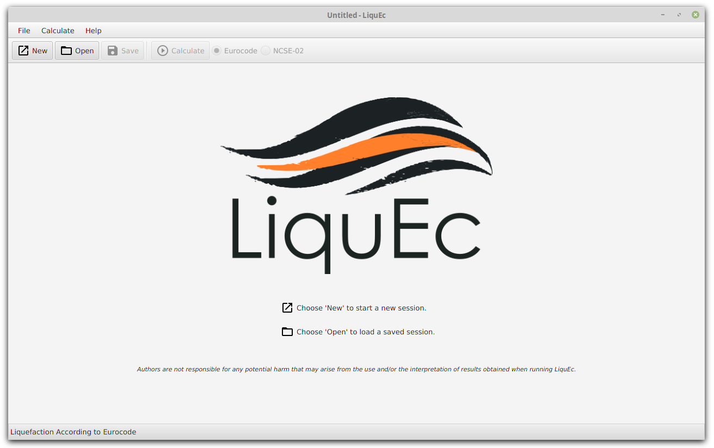
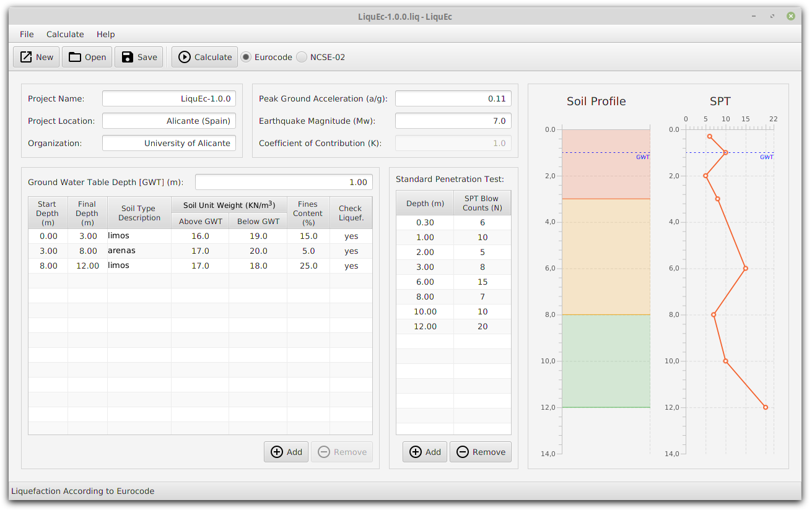
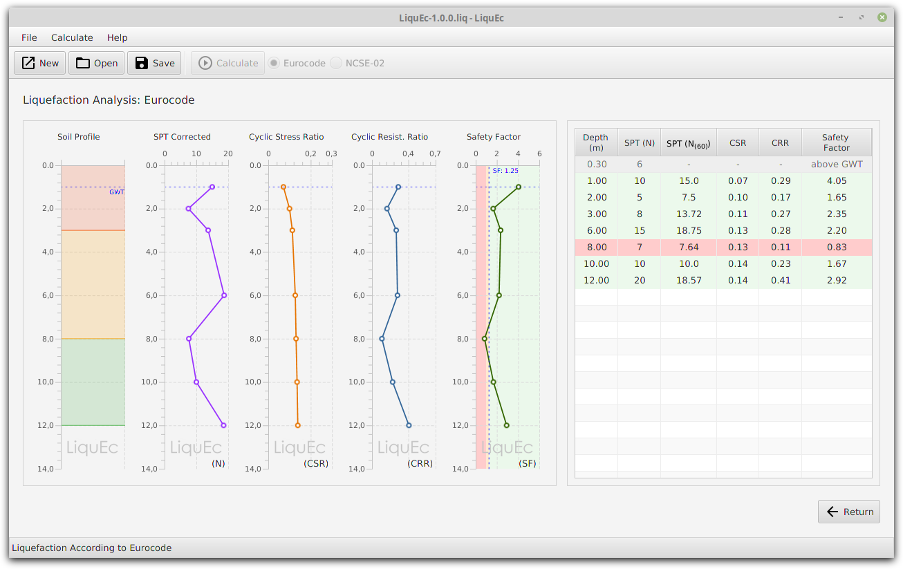
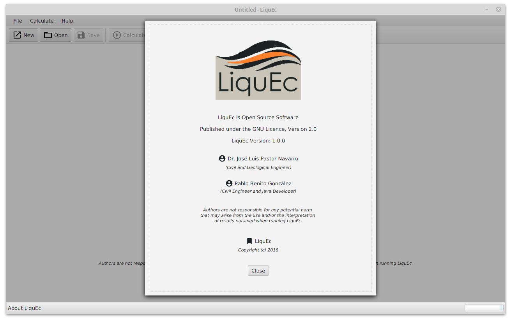

# LiquEc

Liquefaction According to Eurocode

## Authors

Dr. José Luis Pastor Navarro (_Civil and Geological Engineer_)

Pablo Benito González (_Civil Engineer and Java Developer_)

## Prerequisites

You will need Java 8 to build and run LiquEc.  You can download it from the [Oracle Website](http://www.oracle.com/technetwork/java/javase/downloads/index.html).  Everything else, including Gradle, will be downloaded by the build process.

LiquEc is built for Java 8. 

## How To Run LiquEc

Go to the [download](https://personal.ua.es/es/joseluis-pastor/liquec.html) page of the website to get the latest release of LiquEc.  Alternatively, you can run the development version from the command line as follows:
~~~
$ ./gradlew :gui:run
~~~

## How to Use LiquEc

Do you want to use LiquEc to calculate liquefaction?  You'll find everything you need to know to get you started in the guide [How to Use LiquEc](https://personal.ua.es/es/joseluis-pastor/liquec.html).

## How To Build LiquEc

You can build the entire system with the following command:
~~~
$ ./gradlew clean build
~~~

## How To Build An Installable Bundle

LiquEc is distributed as an installable bundle, with everything the user needs packed into the file.  On Windows this is an `.exe` installer and on Linux a `.deb` package.  On Windows you need to install [Inno Setup](http://www.jrsoftware.org/isdl.php).

You can launch the following command to create the bundle:
~~~
$ ./gradlew clean build jfxNative
~~~

When the build is complete, you will find the bundle file in the directory `package/build/jfx/native`.

## Using the OpenJDK

LiquEc works well if you choose the OpenJDK 8 instead of the Oracle JDK.  If you choose the OpenJDK you may find you need to install JavaFX separately.  For example, on Ubuntu 16.04 you can install the OpenJDK 8 and JavaFX as follows:
~~~
$ sudo apt-get install openjdk-8-jdk
$ sudo apt-get install openjfx
~~~

## Screenshots

## Download Releases

### Microsoft Windows

The latest release of LiquEc can be downloaded as a Zip file: LiquEc-1.0.0.zip.

First extract the contents of the Zip file into a directory. Then run the LiquEc.bat file found in the bin directory. Depending on your Windows version and settings you may see an error preventing you from running the program. If you do, click the ‘More Info’ hyperlink and then choose the ‘Run Anyway’ option.

Alternatively, you can try the experimental new Windows installer: LiquEc-1.0.0.exe.

Double click on the file and you will be taken through the process of installing LiquEc on your PC.

### Linux

The latest release of Linux can be downloaded as a Deb file here: LiquEc-1.0.0.deb.

You can install the package as follows:

~~~
$ sudo dpkg -i LiquEc-1.0.0.deb
~~~

LiquEc will now run like any other Linux desktop application.

### Apple Mac

At the moment there is no installable version for MAC and it is not planned to develop it in the immediate future.

## Special Thanks

This project is based on the structure of the great [VocabHunter](https://github.com/VocabHunter/VocabHunter), developed by [@AdamCarroll](https://github.com/AdamCarroll).

This project uses [emxsys](https://bitbucket.org/emxsys/javafx-chart-extensions/wiki/Home) chart extensions.

## Responsability
Authors are not responsible for any potential harm that may arise from the use and/or the interpretation of results obtained when running LiquEc.
